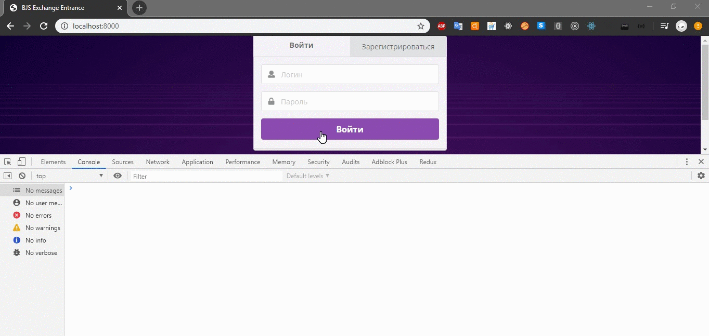

# Реализация страницы «Вход и регистрация».

Перед началом работы ознакомьтесь с [возможностями работы реализованных классов](./classes_description.md).

Для работы с формой регистрации и авторизации используется класс `UserForm`.
Для работы с сервером используется класс `ApiConnector`.

В классе `UserForm` актуальными свойствами будут использоваться:
1. `loginFormCallback` — функция, которая будет выполняться при попытке авторизации
2. `registerFormCallback` — функция, которая будет выполняться при попытке регистрации

Разный вывод информации из формы (в консоль и в alert):

В классе `ApiConnector` актуальными на данной странице будут методы:
1. `login({login, password}, callback)`
2. `register({login, password}, callback)`

Отправка запросов авторизации (неверный пароль, корректная авторизация и логаут):

Оба метода являются статическими. Аргументами методов является объект со свойствами `login` и `password` (логин и пароль), а так же колбек — функция, которая должна выполняться после выполнения запроса.

## Особенности
Для работы с проектом уже созданы пользователи, которыми можно пользоваться.
* login: *oleg@demo.ru*, password: *demo*
* login: *ivan@demo.ru*, password: *demo*
* login: *petr@demo.ru*, password: *demo*
* login: *galina@demo.ru*, password: *demo*
* login: *vladimir@demo.ru*, password: *demo*

## Реализация задания
1. Подключите строгий режим выполнения кода.
2. Создайте объект класса `UserForm`.
3. Присвойте свойству `loginFormCallback` созданного объекта значение функции, которая в качестве аргумента принимает объект `data` (объект, который содержит логин и пароль, введённые в форму, и который будет передаваться внутри `loginFormAction`). 
    1. Функция должна выполнять запрос на сервер для попытке авторизации пользователя (авторизацию пользователя выполняйте с помощью `ApiConnector.login`).
    2. Передайте в запрос авторизации функцию, которая будет выполняться при попытке авторизации.
    2. Посмотрите в консоли, какой объект возвращает сервер.
    3. Проверьте успешность запроса.
    4. В случае успеха запроса обновите страницу (с помощью `location.reload();`).
    5. В случае провала запроса выведите ошибку в окно для ошибок.
4. Проделайте аналогичные действия со свойством `registerFormCallback`.
    1. Передайте запрос на регистрацию.
    2. Напишите колбек, который будет выполняться после запроса.
    3. Выведите ошибку или обновите страницу.
    
Как только получится залогиниться, вернуться на страницу входа / регистрации будет уже нельзя. Реализация возможности разлогиниться будет следующим этапом работы.